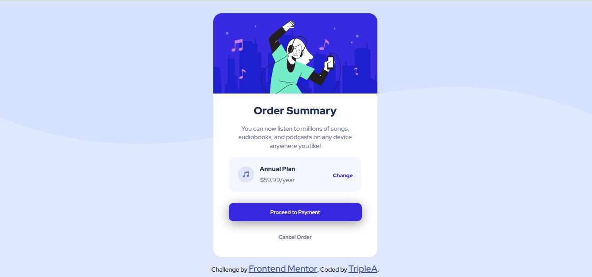

# Frontend Mentor - Order summary card solution

This is a solution to the [Order summary card challenge on Frontend Mentor](https://www.frontendmentor.io/challenges/order-summary-component-QlPmajDUj). Frontend Mentor challenges help you improve your coding skills by building realistic projects. 

## Table of contents

- [Overview](#overview)
  - [The challenge](#the-challenge)
  - [Screenshot](#screenshot)
  - [Links](#links)
  - [Built with](#built-with)
  - [What I learned](#what-i-learned)
  - [Continued development](#continued-development)
- [Author](#author)


## Overview
A frontend-mentor challenge on Order summary card component solution, Which involve building an interface for an Order summary card, making it responsive and interactive
### The challenge

Users should be able to:

- See hover states for interactive elements

### Screenshot





### Links

- Solution URL: [Add solution URL here](https://github.com/TRIPLE-ADE/Order-summary-card-solution)
- Live Site URL: [Add live site URL here](https://triple-ade.github.io/Order-summary-card-solution/)


### Built with

- Semantic HTML5 markup
- CSS custom properties
- Flexbox
- CSS Grid


### What I learned


```css
.body{
      display: flex;
      flex-direction: column;
      justify-content: center; 
      align-items: center;
      background-image:url(./images/pattern-background-desktop.svg); 
      background-color: hsl(225, 100%, 94%);
      background-repeat: no-repeat;
      background-position: center top;
      background-size:100% 50%;
      min-height: 100vh;
      
      
    }
```

### Continued development
- Responsiveness
- media query
- best unit for margin, padding, font-size, width


## Author

- Website - [TripleA](https://triple-ade.github.io/Order-summary-card-solution/)
- Frontend Mentor - [@TRIPLE-ADE](https://www.frontendmentor.io/profile/TRIPLE-ADE)
- Twitter - [@Triple123A](https://www.twitter.com/Triple123A)


